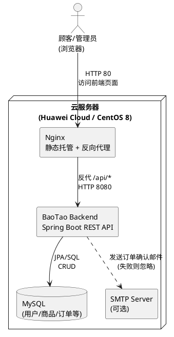
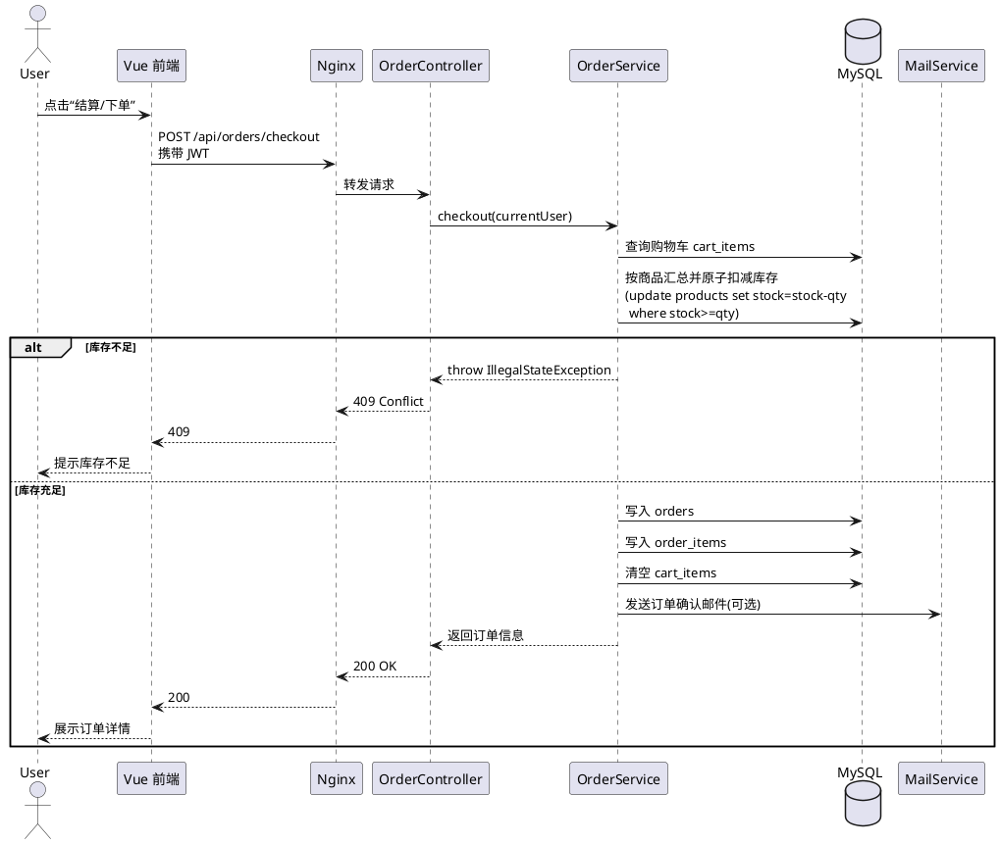

华南理工大学

《网络应用开发》课程实验报告

实验题目： 设计并实现一个电子商务网站的开发和在线部署 

姓名： 潘昊 学号： 20233045141

班级： 23网络工程 

提交日期： 2025-12-16

代码托管地址：https://github.com/June0615o/BaoTao

部署在线网站：1.92.111.3

测试账号口令：账号admin 密码admin123

<table><tbody><tr><td>
<strong>实验概述</strong>
</td></tr><tr><td>
【实验题目】

设计并实现一个电子商务网站的开发和在线部署.

【基本功能要求】

顾客：

用户的注册、登录、注销

展示产品列表

购买流程（浏览/查询-&gt;添加至购物车-&gt;付款-&gt;发送电子邮件确认收货）

可以查看订单状态和历史

销售：

商品目录的管理（包括最基本的增删改等操作）

订单管理、以及销售统计报表

客户管理、以及客户的 浏览/购买 日志 记录

【实验环境和工具】

</td></tr><tr><td>
<strong>实验内容</strong>
<ol><li>系统设计：</li></ol>
给出系统整体架构，并分别介绍各个模块。

<ol><li>代码实现</li></ol>
具体的代码实现过程介绍，并给出关键代码（不要忘记注释）；

<strong>给出github或gitee代码地址</strong>，不要忘记在“readme.md”之中著名自己的学号和姓名，以及代码文件的简单说明。

<ol><li>功能测试：</li></ol>
给出测试方法以及测试过程的详细说明；

给出测试结果的说明（截图）。

<ol><li>应用部署</li></ol>
给出部署的详细过程；

<strong>给出部署的地址，以及相关的测试ID和口令。</strong>

<ol><li>参考文献</li></ol>

</td></tr><tr><td>
<strong>小结</strong>
</td></tr><tr><td>
请给出使用AI辅助完成本课程实验的心得体会（包括：如何使用提示词，对完成任务的效率的提升，是否提高自身的能力，以及应用的局限性和对未来的展望）

</td></tr><tr><td>
<strong>指导教师评语及成绩</strong>
</td></tr><tr><td>

评语：

成绩：&nbsp; &nbsp;&nbsp;指导教师签名：

&nbsp;&nbsp;&nbsp;&nbsp;&nbsp;&nbsp;&nbsp;&nbsp;&nbsp;&nbsp;&nbsp;&nbsp;&nbsp;&nbsp;&nbsp;&nbsp;&nbsp;&nbsp;&nbsp;&nbsp;&nbsp;&nbsp;&nbsp;&nbsp;&nbsp;&nbsp;&nbsp;&nbsp;&nbsp;&nbsp;&nbsp;&nbsp;&nbsp;&nbsp;&nbsp; &nbsp;&nbsp;&nbsp;&nbsp;&nbsp;&nbsp;&nbsp;&nbsp;&nbsp;&nbsp;&nbsp; 批阅日期：
</td></tr></tbody></table>

---

### 实验内容（填写）

#### 1）系统设计

本系统采用 **前后端分离** 架构：

- **前端（Vue3 + Vite + Element Plus + Pinia）**：负责页面展示与交互，请求统一走 `/api`。
- **Web 入口（Nginx）**：托管前端静态文件，并将 `/api` 反向代理到后端 Spring Boot。
- **后端（Spring Boot + Spring Security + JWT + JPA）**：提供 REST API、鉴权与业务逻辑处理。
- **数据层（MySQL）**：持久化用户、商品、购物车、订单、浏览日志等数据。
- **邮件模块（Spring Mail）**：下单后发送订单确认邮件（SMTP 不可用时降级为日志告警）。

**整体架构图（PlantUML）**：

**核心业务流程（下单/结算）时序图（PlantUML）**：

#### 2）代码实现（核心模块说明 + 注释）

- **后端入口**：`src/main/java/com/junevi/baotao/BaoTaoApplication.java`
- **Controller 层**：`src/main/java/com/junevi/baotao/controller/*Controller.java`（REST API）
- **Service 层**：`src/main/java/com/junevi/baotao/service/*Service.java`（业务逻辑：购物车、下单、统计等）
- **Repository 层**：`src/main/java/com/junevi/baotao/repository/*Repository.java`（JPA 数据访问）
- **安全模块**：`src/main/java/com/junevi/baotao/security/*`（JWT 过滤器、权限控制）
- **前端**：`frontend/src/*`（Vite + Vue3），请求封装在 `frontend/src/api/http.ts`

说明：已对关键业务逻辑（如下单扣库存）、安全配置（JWT 认证链路）等核心代码补充了 Javadoc/行内注释，便于阅读与实验检查。

#### 3）功能测试（方法与过程）

建议截图与说明覆盖以下测试点：

- **登录/鉴权**：注册 → 登录获取 JWT → 携带 JWT 访问受保护接口成功；不带 JWT 返回 401/403。
- **商品/购物车**：商品列表查询 → 加入购物车 → 修改数量 → 删除。
- **下单**：购物车结算生成订单；库存充足时下单成功并扣减库存；库存不足时返回 409 并提示。
- **管理员功能**：管理员登录后进入后台；商品增删改；订单状态更新；统计报表接口返回正常。

#### 4）应用部署（关键步骤摘要）

线上地址：`http://1.92.111.3/`  
测试账号：`admin / admin123`

部署摘要（详细命令可参考 README）：

- 后端：在 CentOS8 上使用 systemd 托管 jar（`/opt/baotao/BaoTao-0.0.1-SNAPSHOT.jar`），环境变量文件 `/etc/sysconfig/baotao` 配置数据源。
- 前端：将 `frontend/dist` 上传至 `/usr/share/nginx/html`，Nginx 同时反代 `/api/` 到后端 `8080`。
- 安全组/防火墙：开放 `80/tcp`；数据库端口建议不对公网开放。

#### 5）参考文献

- Spring Boot / Spring Security 官方文档
- Vue 3 / Vite 官方文档
- Nginx 官方文档